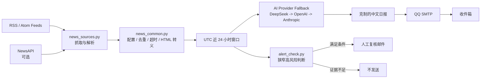
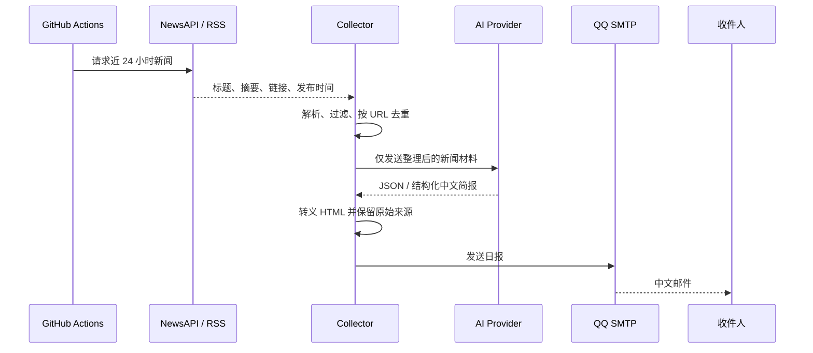
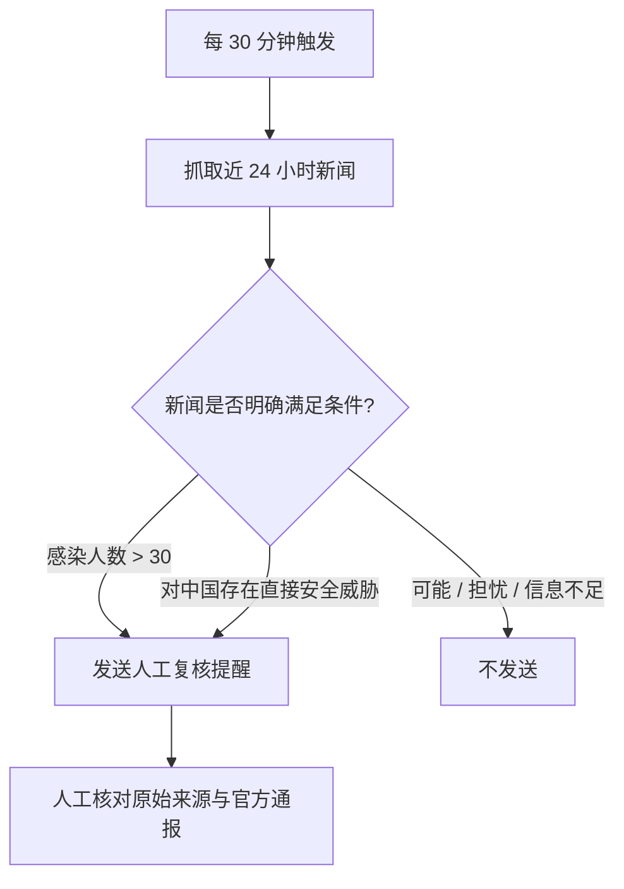

# Daily News Collector


> 基于 GitHub Actions 的公共卫生新闻信息整理工具：抓取近 24 小时的 NewsAPI/RSS 新闻，经 AI 辅助整理后发送中文日报，并用独立的高风险规则流程提醒人工复核。

> **重要边界：** 本项目不是医疗诊断、疫情预测或官方预警系统。所有结论都必须回到原始新闻、当地卫生部门和专业医生进行核查。

## 项目做什么

项目把“公开新闻采集”和“人工核查提醒”拆成两条工作流。日报流程尽量完整保留原始链接、时间、地点和明确数字；预警流程只在新闻明确满足狭窄条件时发送提醒，信息不足时应保持静默。

## 系统架构



共享模块负责网络超时、HTTP 状态检查、RSS/NewsAPI 解析、模型回退、JSON 解析、HTML 转义和 SMTP 发送；日报与预警脚本只负责组织各自的业务流程。

## 功能流程

### 每日简报



### 高风险复核



预警条件只包括：新闻明确提到感染人数超过 30 人，或存在对中国境内的直接安全威胁。标题猜测、可能性描述和计划检测不能单独触发预警。

## 文件结构

```text
collect_and_send.py       # 每日采集、摘要和邮件发送
alert_check.py            # 高风险条件判断和复核邮件
news_common.py            # 配置、HTTP、模型回退、HTML、SMTP
news_sources.py           # NewsAPI 与 RSS/Atom 解析
test_news_common.py       # 共享模块测试
test_news_sources.py      # 新闻源解析测试
test_pipeline.py          # 聚合、去重和失败边界测试
.github/workflows/
  main.yml                # 每日简报工作流
  alert.yml               # 每 30 分钟复核工作流
```

## GitHub Actions 配置

### 必需 Secrets

| Secret | 是否必需 | 用途 |
|---|---:|---|
| `QQ_EMAIL_PASSWORD` | 是 | QQ 邮箱 SMTP 授权码，不是网页登录密码。 |
| `DEEPSEEK_API_KEY` / `OPENAI_API_KEY` / `ANTHROPIC_API_KEY` | 至少一个 | AI 摘要与预警判断的模型密钥。 |
| `NEWS_API_KEY` | 否 | NewsAPI 密钥；没有时仍可使用 RSS。 |
| `NEWS_SENDER` | 否 | 发件邮箱；未设置时使用项目默认值。 |
| `NEWS_RECEIVER` | 否 | 收件邮箱；未设置时发送给发件邮箱。 |

### Repository Variables

| Variable | 默认值 | 说明 |
|---|---|---|
| `NEWS_RSS_URLS` | 项目内默认 ECDC RSS | 以英文逗号分隔的 RSS/Atom 地址。 |
| `AI_FALLBACK_PROVIDERS` | `deepseek,openai,anthropic` | 模型回退顺序，只尝试已配置密钥的提供商。 |
| `DEEPSEEK_MODEL` | `deepseek-chat` | DeepSeek 模型名。 |
| `OPENAI_MODEL` | `gpt-4o-mini` | OpenAI 模型名。 |
| `ANTHROPIC_MODEL` | `claude-3-5-haiku-latest` | Anthropic 模型名。 |
| `OPENAI_BASE_URL` | OpenAI Chat Completions 地址 | 兼容 OpenAI 协议的服务地址。 |
| `ANTHROPIC_BASE_URL` | Anthropic Messages 地址 | 兼容 Anthropic Messages 的服务地址。 |

配置示例：

```text
NEWS_RSS_URLS=https://example.org/health/feed.xml,https://example.org/public-health.atom
AI_FALLBACK_PROVIDERS=deepseek,openai,anthropic
```

不要把密钥写入 Python 文件、README、日志、测试 fixture 或提交记录。如果密钥曾经出现在公共仓库中，应立即在服务商后台撤销并重新生成。

## 本地运行

```bash
python3 -m venv .venv
source .venv/bin/activate
python -m pip install -r requirements.txt
export NEWS_API_KEY='your-newsapi-key'
export DEEPSEEK_API_KEY='your-deepseek-key'
export QQ_EMAIL_PASSWORD='your-qq-smtp-password'
python collect_and_send.py
python alert_check.py
```

正式运行前，建议使用 GitHub Actions 的 `workflow_dispatch` 手动触发，确认密钥、SMTP 授权码、发件人和收件人均正确。

## 测试与质量检查

项目测试不要求真实 API、LLM 或 SMTP 连接：

```bash
python -m unittest -v
```

测试覆盖 JSON 解析、代码块 JSON、HTML 转义、危险 URL、模型回退、RSS/Atom 解析、新闻源去重、分页限制、单个来源失败时的降级，以及所有来源失败时的明确错误。

## 设计上的可靠性措施

网络请求使用连接和读取超时；NewsAPI 和 RSS 会检查返回状态；AI 提供商按配置顺序回退；新闻按 URL 去重；HTML 内容经过转义；原始来源链接保留在邮件中；GitHub Actions 使用最小权限、并发控制和运行超时。

这些措施只能提高工程可靠性，不能保证新闻真实、完整或及时。新闻源可能延迟、误报、重复或缺少上下文，AI 输出也可能理解错误。

## 免责声明

本项目只用于辅助阅读公开信息。日报、AI 摘要和人工复核提醒都不构成医疗建议、疫情预测、公共卫生结论、交易建议或应急决策。任何需要行动的判断，都必须由人工核对原始报道、官方通报和专业机构意见。
